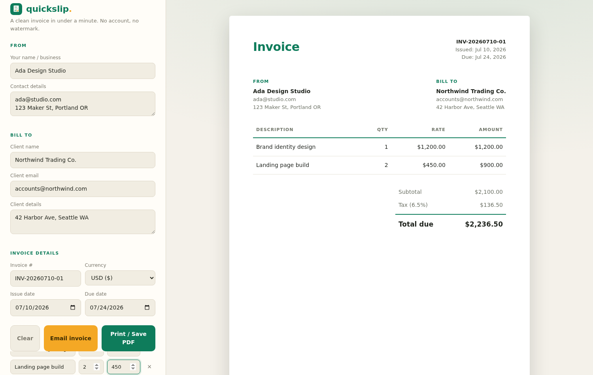

  

# quickslip

A clean, professional invoice in under a minute. No account, no watermark, no upsell — open the page, fill in the blanks, then print it or email it.

## Who it's for

Freelancers, consultants, and small side-business owners who send a handful of invoices a month and don't want to pay for (or log into) a full invoicing suite just to bill a client.

## How to use

1. Open `index.html` in any modern browser.
2. Fill in your details, the client's details, and your line items — the invoice preview updates live as you type.
3. For US sales tax, pick your state and the statewide base rate fills in automatically (editable, since city/county taxes may apply on top).
4. Click **Print / Save PDF** for a clean single-page PDF, or **Email invoice** to open a pre-written email in your mail app with the full invoice summary in the body.

That's it. Nothing is uploaded anywhere — everything stays in your browser tab.

## Features

- **Live preview** — a pixel-faithful invoice sheet renders beside the form as you type
- **Line items** — add, remove, quantities and rates with automatic per-line and grand totals; press Enter in the last rate field to add a new row
- **US state tax picker** — all 50 states + DC with statewide base sales tax rates, always editable for local rates or other countries
- **Discount** — percentage-based, applied before tax
- **Email invoice** — one click opens your default mail app with the recipient, subject, and a formatted invoice summary pre-filled
- **11 currencies** — USD, EUR, GBP, CAD, AUD, JPY, INR, CHF, SEK/NOK, BRL, MXN
- **Smart defaults** — auto-generated invoice number, issue date today, due date +14 days
- **Print-ready** — dedicated print stylesheet produces a clean single-page PDF with no app chrome
- **Responsive** — works on a phone in a pinch; form stacks above the preview
- **Private by design** — no backend, no analytics, no data leaves the page

## Tech

Single self-contained HTML file. No build step, no dependencies. Host it anywhere static files go. The logo is an original SVG mark made for this project.
